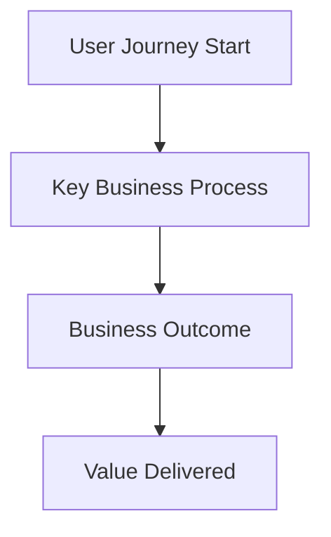
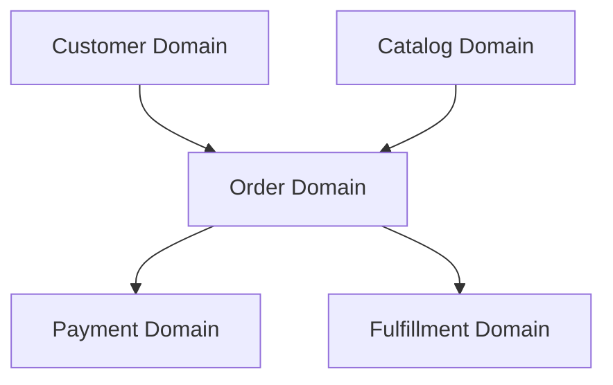
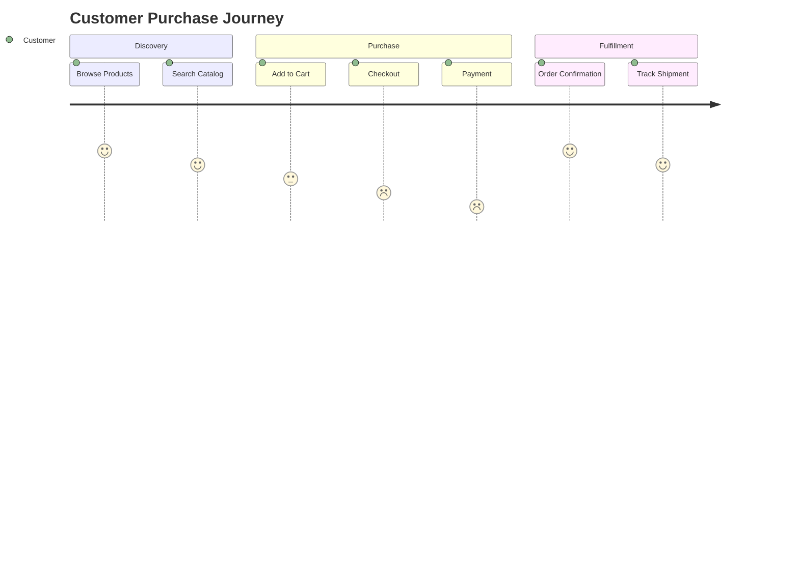

# Business Overview Template - 01_overview.md

## Template Instructions

This template generates a comprehensive business overview of the .NET codebase. Focus on business value, domain modeling, and stakeholder perspectives rather than technical implementation details.

### Analysis Approach

1. **Domain Discovery**: Analyze namespace structure, entity models, and business logic to identify domains
2. **Business Capability Mapping**: Understand what the system does from a business perspective
3. **Stakeholder Analysis**: Identify different user types and their interactions with the system
4. **Value Proposition**: Articulate the business problem being solved

### Content Guidelines

#### Product Overview Section
- Lead with the business problem being solved
- Explain the target users and their needs
- Describe the core value proposition
- Avoid technical jargon - focus on business outcomes

#### Business Domains Section
- Identify logical business areas (e.g., Catalog, Orders, Identity)
- Describe each domain's purpose and responsibilities
- Map domains to major namespace/folder structures
- Explain relationships between domains

#### Stakeholder Analysis Section
- List different user types (customers, administrators, partners)
- Describe each stakeholder's key scenarios and goals
- Map stakeholders to major system capabilities

#### Domain Diagram Section
- Use Mermaid diagrams to visualize domain relationships
- Focus on business concepts, not technical architecture
- Show data flow from a business process perspective

### Example Structure

```markdown
# {PROJECT_NAME} - Business Overview

## Product Overview

### What is {PROJECT_NAME}?
[Business description focusing on value proposition]

### Target Users
[Description of primary and secondary user types]

### Core Business Value
[Key benefits and outcomes the system provides]

## Business Domains

### {Domain 1 Name}
**Purpose**: [What this domain is responsible for]
**Key Entities**: [Main business objects]
**Primary Capabilities**: [What users can do]

### {Domain 2 Name}
[Similar structure for each identified domain]

## Stakeholder Analysis

### {Stakeholder Type 1}
**Role**: [Who they are]
**Goals**: [What they want to achieve]
**Key Scenarios**: [How they use the system]

## Business Process Flow



## Key Business Capabilities

1. **{Capability 1}**: [Description and business value]
2. **{Capability 2}**: [Description and business value]

## Success Metrics

- [Business KPI 1]
- [Business KPI 2]
- [User satisfaction measure]
```

### Analysis Prompts

When analyzing the codebase, consider these questions:

#### Domain Identification
- What are the main business concepts represented in the code?
- How is the namespace/folder structure organized?
- What entities and aggregates exist?
- What business rules are encoded in the system?

#### User Journey Analysis
- What different user paths exist through the application?
- What are the key workflows and business processes?
- Where do users enter and exit the system?
- What decisions do users need to make?

#### Value Creation Analysis
- What business problems does this system solve?
- How does it create value for different stakeholders?
- What competitive advantages does it provide?
- What operational efficiencies does it enable?

### Code Analysis Focus Areas

To generate business insights, examine:

#### Entity Models and DTOs
```csharp
// Look for business concepts
public class Order { }
public class Product { }
public class Customer { }
```

#### Service Layer Business Logic
```csharp
// Understand business rules and workflows
public class OrderService
{
    public async Task ProcessOrder() { }
    public async Task CalculateShipping() { }
}
```

#### Controller Actions and Endpoints
```csharp
// Map user scenarios
[HttpPost("api/orders")]
public async Task CreateOrder() { }
```

#### Validation and Business Rules
```csharp
// Identify business constraints
[Required]
[Range(1, 1000)]
public decimal Price { get; set; }
```

### Quality Checklist

Before finalizing the business overview:

- [ ] Business value is clearly articulated
- [ ] Domains are logical and well-defined
- [ ] Stakeholders are accurately identified
- [ ] Domain diagram shows business relationships
- [ ] Technical implementation details are minimized
- [ ] Language is accessible to business stakeholders
- [ ] Key capabilities map to user needs
- [ ] Success metrics are business-focused

### Common Patterns to Look For

#### E-commerce/Retail
- Catalog management
- Order processing
- Inventory management
- Customer management
- Payment processing

#### Content Management
- Content creation and publishing
- User management and permissions
- Workflow and approval processes
- Search and discovery

#### Enterprise Applications
- Document management
- Approval workflows
- Reporting and analytics
- Integration with external systems

### Diagram Guidelines

#### Domain Relationship Diagram


#### User Journey Diagram


### Integration with Technical Documentation

The business overview should:
- Reference technical details document for implementation specifics
- Provide context for the API inventory
- Set the stage for individual API documentation
- Bridge business and technical perspectives