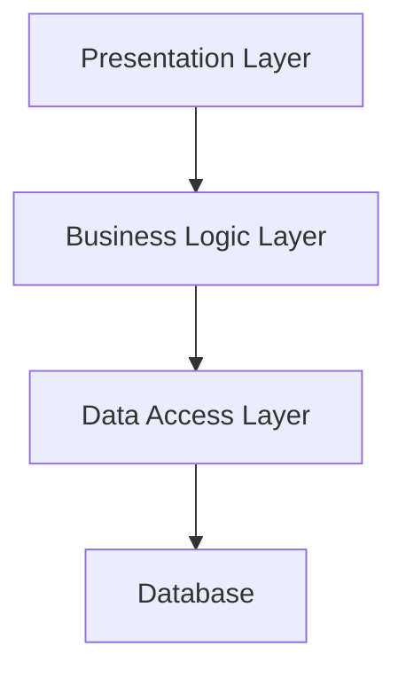
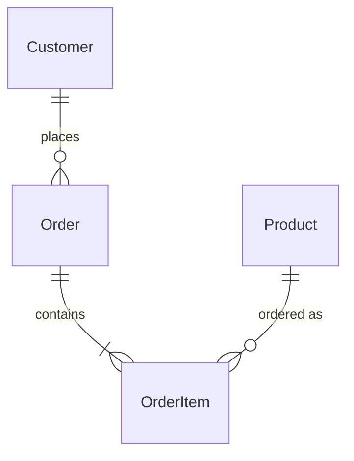
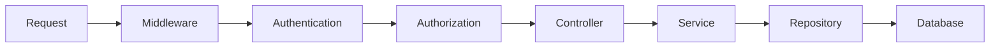
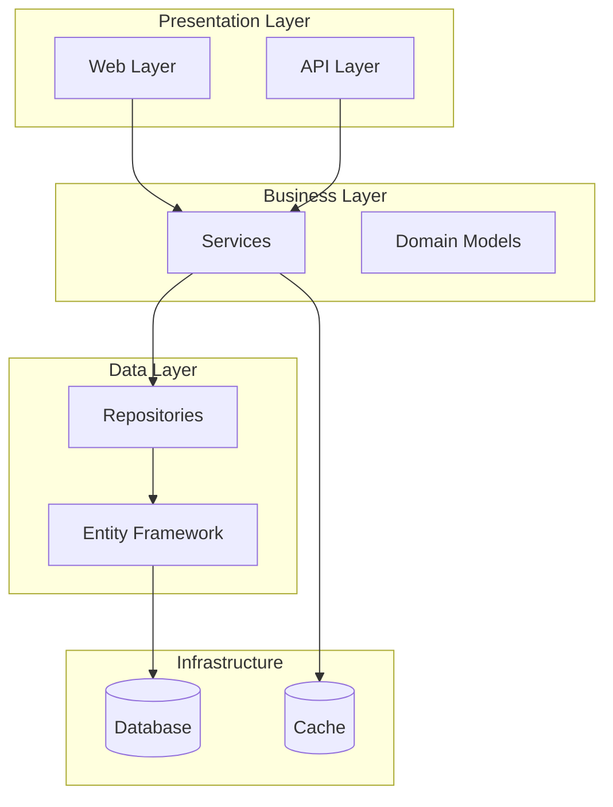
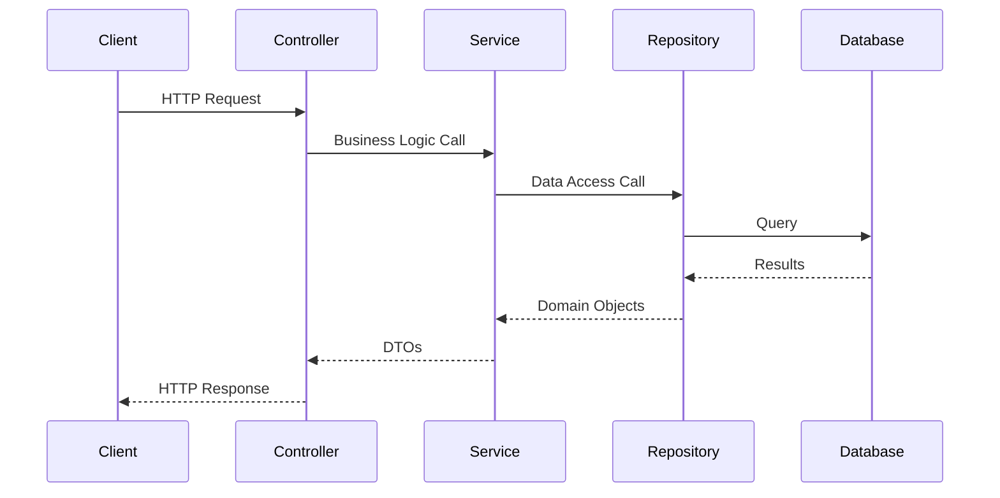

# Technical Details Template - 02_technical_details.md

## Template Instructions

This template generates comprehensive technical documentation focusing on architecture, implementation patterns, security, and system design. This complements the business overview with deep technical insights.

### Analysis Approach

1. **Architecture Pattern Recognition**: Identify Clean Architecture, MVC, layered architecture, etc.
2. **Technology Stack Analysis**: Document frameworks, libraries, and dependencies
3. **Security Pattern Review**: Identify authentication, authorization, and security practices
4. **Data Flow Analysis**: Understand how data moves through the system
5. **Integration Point Mapping**: Document external dependencies and services

### Content Guidelines

#### System Architecture Section
- Identify and describe the overall architectural pattern
- Document layer separation and responsibilities
- Explain dependency flow and coupling strategies
- Focus on design principles being followed

#### Technology Stack Section
- List major frameworks (.NET version, ASP.NET Core, Entity Framework)
- Document key libraries and their purposes
- Identify third-party integrations
- Note configuration and deployment technologies

#### Security Approach Section
- Document authentication mechanisms (JWT, Identity, etc.)
- Describe authorization patterns and role management
- Identify security middleware and policies
- Note data protection and encryption approaches

#### Data Architecture Section
- Document database technologies and patterns
- Describe entity relationships and domain modeling
- Explain data access patterns (Repository, Unit of Work, etc.)
- Identify caching strategies

### Example Structure

```markdown
# {PROJECT_NAME} - Technical Details

## System Architecture

### Architecture Pattern
[Clean Architecture/Layered Architecture/MVC/etc.]

### Layer Structure


### Design Principles
- [Principle 1: Description]
- [Principle 2: Description]

## Technology Stack

### Core Framework
- **.NET Version**: [e.g., .NET 8.0]
- **Web Framework**: [e.g., ASP.NET Core 8.0]
- **API Style**: [Minimal APIs/MVC Controllers/Mixed]

### Key Libraries
| Library | Version | Purpose |
|---------|---------|---------|
| Entity Framework Core | x.x.x | Data Access |
| AutoMapper | x.x.x | Object Mapping |
| Serilog | x.x.x | Logging |

### Infrastructure
- **Database**: [SQL Server/PostgreSQL/etc.]
- **Caching**: [Redis/In-Memory/etc.]
- **Message Queue**: [Service Bus/RabbitMQ/etc.]

## Security Architecture

### Authentication
- **Method**: [JWT/Cookie/Identity Server/etc.]
- **Provider**: [ASP.NET Core Identity/External/etc.]
- **Token Management**: [Description]

### Authorization
- **Strategy**: [Role-based/Policy-based/Claims-based]
- **Implementation**: [Description of how authorization works]

### Data Protection
- **Encryption**: [At rest/In transit methods]
- **Secrets Management**: [Azure Key Vault/Configuration/etc.]

## Data Architecture

### Database Design


### Data Access Patterns
- **Pattern**: [Repository/Unit of Work/Direct EF/etc.]
- **ORM**: [Entity Framework Core configuration]
- **Migrations**: [Strategy and approach]

## API Design

### API Style
- **Pattern**: [RESTful/GraphQL/RPC]
- **Versioning**: [Strategy if applicable]
- **Documentation**: [Swagger/OpenAPI configuration]

### Request/Response Patterns
- **Serialization**: [System.Text.Json/Newtonsoft]
- **Validation**: [FluentValidation/Data Annotations/etc.]
- **Error Handling**: [Global exception handling approach]

## Application Flow

### Request Pipeline


### Key Middleware
1. **[Middleware 1]**: [Purpose and configuration]
2. **[Middleware 2]**: [Purpose and configuration]

## Development Practices

### Code Organization
- **Project Structure**: [Description of solution organization]
- **Namespace Strategy**: [How namespaces are organized]
- **Folder Conventions**: [How folders are structured]

### Configuration Management
- **Settings**: [appsettings.json/Environment variables/etc.]
- **Environment Strategy**: [Development/Staging/Production differences]
- **Secret Management**: [How sensitive data is handled]

## Performance Considerations

### Optimization Strategies
- **Caching**: [Where and how caching is implemented]
- **Database**: [Indexing strategy, query optimization]
- **API**: [Response optimization, pagination]

### Monitoring
- **Logging**: [Framework and strategy]
- **Metrics**: [Performance monitoring approach]
- **Health Checks**: [Implementation and endpoints]
```

### Analysis Focus Areas

When analyzing the codebase, examine:

#### Project Structure and Dependencies
```xml
<!-- Analyze .csproj files for dependencies -->
<PackageReference Include="Microsoft.EntityFrameworkCore" Version="8.0.0" />
<PackageReference Include="AutoMapper" Version="12.0.0" />
```

#### Startup/Program Configuration
```csharp
// Understand service registration and middleware pipeline
builder.Services.AddDbContext<AppDbContext>();
builder.Services.AddScoped<IRepository, Repository>();
app.UseAuthentication();
app.UseAuthorization();
```

#### Architecture Patterns
```csharp
// Look for architectural patterns
public interface IRepository<T> { }
public class Service
{
    private readonly IRepository _repo;
    private readonly IMapper _mapper;
}
```

#### Security Configuration
```csharp
// Identify security implementations
[Authorize(Policy = "AdminOnly")]
[AllowAnonymous]
services.AddJwtBearer();
```

#### Data Models and Context
```csharp
// Understand data architecture
public class ApplicationDbContext : DbContext
{
    public DbSet<Product> Products { get; set; }
}
```

### Code Analysis Patterns

#### Clean Architecture Indicators
- Separate projects for Core, Infrastructure, Web
- Dependency inversion with interfaces
- Domain models in core layer

#### MVC Pattern Indicators
- Controllers inheriting from ControllerBase
- ViewModels and DTOs
- Service layer separation

#### Minimal API Indicators
- MapGet/MapPost endpoint definitions
- Program.cs-centric configuration
- Functional programming approach

### Quality Checklist

Before finalizing technical documentation:

- [ ] Architecture pattern is clearly identified
- [ ] Technology stack is comprehensive and current
- [ ] Security implementation is well documented
- [ ] Data flow and relationships are clear
- [ ] API design patterns are explained
- [ ] Performance considerations are addressed
- [ ] Code examples support explanations
- [ ] Diagrams illustrate complex relationships

### Common .NET Patterns to Document

#### Dependency Injection
```csharp
services.AddScoped<IService, Service>();
services.AddTransient<IRepository, Repository>();
```

#### Entity Framework Patterns
```csharp
// Code First approach
public class ApplicationDbContext : DbContext
{
    protected override void OnModelCreating(ModelBuilder builder)
    {
        // Configuration
    }
}
```

#### ASP.NET Core Identity
```csharp
services.AddDefaultIdentity<ApplicationUser>()
    .AddEntityFrameworkStores<ApplicationDbContext>();
```

#### Middleware Pipeline
```csharp
app.UseRouting();
app.UseAuthentication();
app.UseAuthorization();
app.MapControllers();
```

### Integration Points Analysis

#### External Services
- HTTP clients and API integrations
- Message queue consumers/producers
- Third-party service dependencies

#### Configuration Sources
- appsettings.json hierarchy
- Environment variables
- Azure Key Vault or similar

#### Deployment Considerations
- Docker configuration
- Cloud service dependencies
- Environment-specific settings

### Diagram Guidelines

#### System Architecture Diagram


#### Request Flow Diagram
